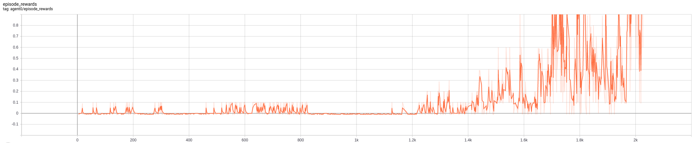
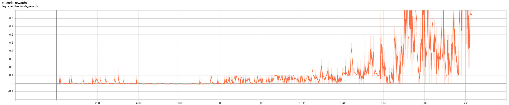
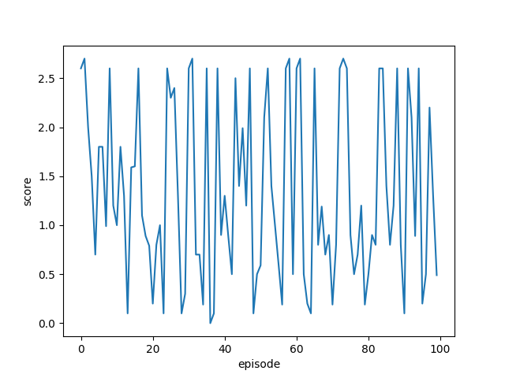

[TOC]
# 1. MADDPG
MADDPG stands for "Multi-Agents Deep Deterministic Policy Gradient", originally proposed by [Lowe et al., 2017](https://arxiv.org/pdf/1706.02275.pdf)

### 1.1 Introduction

* When a game involves multiple agents, sometimes we need the agents to learn a policy w.r.t. global advantages by compete or collaborate with each other to win the game.
* Due to the interactions between multiple agents, the state of game could be not stationary, and hard (impossible) to learn.
* The solution is using Actor-Critic, more specifically "centralized critic" + "decentralized actors"
* Using "centralized critic" to evaluate the global advantages, to find the path to win the game
* Using "decentralized actors" to form a policy for each agent based on the guides from "centralized critic"
* Questions, which not solved in this project yet.
  * I implement a general MADDPG with centralized critic in this project, however how and what the actors should communicate or sense with each other was not discussed in this project yet.
* A short review of single agent DDPG from my last [project](https://github.com/masszhou/unity_reacher/blob/master/report.pdf).

### 1.2 Notation and Model
* There are $N$ agents
* with a set of state $S$ in total
* each agent has a set of possible action $\mathcal{A}_1,\dots,\mathcal{A}_N$
* each agent has a set of observation $\mathcal{O}_1,\dots,\mathcal{O}_N$
* each agent has own a stochastic policy $\pi_{\theta_i}:\mathcal{O}_i\times\mathcal{A}_i\mapsto[0,1]$
  * or a deterministic policy $\mu_{\theta_i}:\mathcal{O}_i\mapsto\mathcal{A}_i$
* let $\vec{o}=o_1,o_2,\dots,o_N$ as observation of all agents
* let $\vec{\mu}=\mu_1,\mu_2,\dots,\mu_N$, which are parameterized by $\vec{\theta}=\theta_1,\theta_2,\dots,\theta_N$, where $\mu_{\theta_i}$ abbreviated as $\mu_i$.
* the critic in MADDPG learns **a centralized action-value function** $Q_i^{\vec{\mu}}(\vec{x},a_1,a_2,\dots,a_N)$ for the i-th agent, where $a_1\in\mathcal{A}_1\dots a_N \in\mathcal{A}_N$
  * For the simplest case, we concatenate states of all agents together as $\vec{x}=\vec{o}=(o_1,o_2,\dots,o_N)$
  * or we can add more reward structure for competitive setting or others.
* each $Q_i^{\vec{\mu}}$ is learned **separately**.
  * separately means each agent has own critic network
  * the critic of each agent learns from training data of all agents
  * a better illustration can be found in below fig. 

#### Critic Updates

$$
\begin{eqnarray}
\mathcal{L}(\theta_i) &=& \mathbb{E}[(Q_i^{\vec{\mu}}(\vec{o},a_1,a_2,\dots,a_N) -y)^2] \\
\text{where } y &=& r_i + \gamma Q_i^{\vec{\mu}'}(\vec{o}',a'_1,a'_2,\dots,a'_N) \vert_{a_j'=\vec{\mu}'_j(o_j)}
\end{eqnarray}
$$
* prime notion means target network, e.g. $Q_i^{\vec{\mu}'}$ is target critic network, delayed updating. $\vec{\mu}'$ is **target actor network**.
* $\vert_{a_j'=\vec{\mu}'_j(o_j)}$ means using action $a_j'$ of the j-th agent from j-th **target actor network**, which suppose to max Q

psudo codes
```python
# use this experience
# states  -> rank=3, shape=[batch_size, agent_id, state_size]
# actions -> rank=3, shape=[batch_size, agent_id, action_size]
# rewards -> rank = 2, shape = [batch_size, agent_id]
# next_states -> rank = 3, shape = [batch_size, agent_id, state_size]
# dones   -> rank=2, shape=[batch_size, agent_id]
states, actions, rewards, next_states, dones = experiences

# to update this agent
agent = self.agent_pool[agent_id]

# ------------------------------------------
# update centralized critic
# ------------------------------------------
# -- recall update critic for normal DDPG
# best_actions = self.actor_target(next_states)
# Q_next_max = self.critic_target(next_states, best_actions)
# Q_target = rewards + gamma * Q_next_max * (1 - dones)
# Q_local = self.critic_local(states, actions)
# critic_loss = F.mse_loss(Q_local, Q_target.detach())
# self.critic_optimizer.zero_grad()
# critic_loss.backward()
# self.critic_optimizer.step()

target_actions = self.eval_target_act(next_states)  
# out list of tensor, tensor rank=2, shape=[batch_size, out_actor]

target_actions = torch.cat(target_actions, dim=1)  
# out tensor, rank=2, shape=[batch_size, n_agent*action_size]

# in tensor, rank=2, shape=[batch_size, n_agent*state_size]
# in tensor, rank=2, shape=[batch_size, n_agent*action_size]
target_critic_input = torch.cat((next_states.view(self.batch_size, -1),  
                                 target_actions),  
                                dim=1).to(device)
# out tensor, rank=2, shape=[batch_size, n_agent*(state_size+action_size)]

with torch.no_grad():
    q_next = agent.target_critic(target_critic_input)  
    # out tensor, rank=2, shape=[batch_size, 1]

agent_rewards = rewards[:, agent_id] 
# out tensor, rank = 1, shape = [batch_size]

agent_dones = dones[:, agent_id] 
# out tensor, rank = 1, shape = [batch_size]

q_target = agent_rewards.view(-1, 1) + gamma * q_next * (1 - agent_dones.view(-1, 1))
# out tensor, rank=2, shape=[batch_size, 1]

# out tensor, rank=2, shape=[batch_size, n_agent*state_size]
# out tensor, rank=2, shape=[batch_size, n_agent*action_size]
local_critic_input = torch.cat((states.view(self.batch_size, -1),  
                                actions.view(self.batch_size, -1)),  
                                dim=1).to(device)
q_local = agent.local_critic(local_critic_input)

critic_loss = F.mse_loss(q_local, q_target.detach())

agent.critic_optimizer.zero_grad()
critic_loss.backward()
agent.critic_optimizer.step()
```


#### Actor Update

$$
\nabla_{\theta_j}J(\mu_j)=\mathbb{E}_{\vec{o},a\in \mathcal{D}}[\nabla_{\theta_j}\mu_i(a_i\vert o_i)\nabla_{a_i}Q_i^{\vec{\mu}}(\vec{o},a_1,\dots,a_N)\vert_{a_i=\mu_i(o_i)}]
$$
  * $\vert_{a_i=\mu_i(o_i)}$ means using action from **local actor network**. 
  * $\mathcal{D}$ contains the SARS tuples $(o,a,r,o')$ for **all agents**. 
  * $Q_i^{\vec{\mu}}$ is centralized action-value function.
  * $Q_i^{\vec{\mu}}(\vec{o},a_1,\dots,a_N)$ is the TD view of $R(\tau)=r_1+r_2+\dots+r_H+r_{H+1}$, recall
$$
\nabla_{\theta}J(\theta) \approx \hat{g} := \frac{1}{m} \sum_i^m \sum_{t=0}^H \nabla_{\theta} \log \pi_{\theta}(a_t^{(i)}|s_t^{(i)})R(\tau^{(i)})
$$

psudo codes
```python
# ------------------------------------------
# update actor
# ------------------------------------------
# -- recall update actor for normal DDPG
# actions_pred = self.actor_local(states)
# Q_baseline = self.critic_local(states, actions_pred)
# actor_loss = -Q_baseline.mean()  # I think this is a good trick to make loss to scalar
# # note, gradients from both actor_local and critic_local will be calculated
# # however we only update actor_local
# self.actor_optimizer.zero_grad()
# actor_loss.backward()
# self.actor_optimizer.step()

pred_actions = self.eval_local_act(states)
# list of tensor, tensor rank=2, shape=[batch_size, out_actor]

pred_actions = torch.cat(pred_actions, dim=1)
# tensor, rank=2, shape=[batch_size, n_agent*action_size]

# tensor, rank=2, shape=[batch_size, n_agent*state_size]
# tensor, rank=2, shape=[batch_size, n_agent*action_size]
local_critic_input2 = torch.cat((states.view(self.batch_size, -1),  
                                 pred_actions),  
                                dim=1).to(device)

q_baseline = agent.local_critic(local_critic_input2)

# get the policy gradient
actor_loss = -q_baseline.mean()  # scalar trick for gradients
agent.actor_optimizer.zero_grad()
actor_loss.backward()
agent.actor_optimizer.step()
```

### 1.3 Inferring Policies of Other Agents (Communication)
* How ? based on task, key implementation for real project

### 1.4 Agents with Policy Ensembles
* each agent has K different sub-policies
  * equivalents to K actor networks
* At each episode, we randomly select one particular sub-policy for each agent to execute. 

### 1.5 Reward Design for Collaborate and Competitive
* How? based on task, Key implementation for real project

### Reference
* a good state of the art [blog](https://lilianweng.github.io/lil-log/2018/04/08/policy-gradient-algorithms.html#maddpg) 
* the original paper ([Lowe et al., 2017](https://arxiv.org/pdf/1706.02275.pdf)). 
* The original paper and this explanation blog have very clean and beautiful math notation.

* a good [blog](https://openai.com/blog/learning-to-cooperate-compete-and-communicate/) from openai

# 2. Implementation Details
### 2.1 Setups

```python
agents = MADDPG(state_size=24,                
                action_size=2,
                n_agents=2,
                gamma=0.99,
                tau=1e-3,
                lr_actor=1e-4,
                lr_critic=5e-4,                
                learn_n_times_per_step=3,
                update_target_every=10,
                memory_size=int(1e5),
                batch_size=256)
```

* who often update target network from local network is a **KEY** parameter for convergence and consistence training result. 

* add proper noise to action is a **KEY** step to explore efficiently.
  * e.g. $dx$ from Ornstein-Uhlenbeck Process can not be too small. in this project, I used sigma=0.5
* learning rate of critic network is important

### 2.2 Results and Discussion

* episodic rewards of two agents

  * agent0


  * agent1



Here are some interesting guess. I observed episodic rewards of the two agents. From episode 0-400, it seems both agents were doing exploration. For episode 400-1200, it seems two agent have **complementary** performance, like adversary, one became great, the other turns to weak, very interesting. 

However in this project I didn't add communication between agents for actor input and explicit extra rewards for collaboration. It is **NOT** very clear, in my opinion, whether the agent has just finally improved own skills or it really learned to play with considering collaboration.

* evaluation
  * average score of 100 episodes is 1.33 (> 0.5 -> solved )

